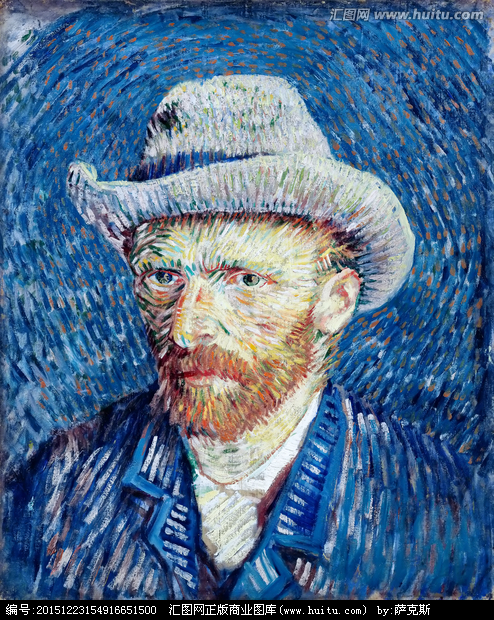

# COMP7404 Group Assignment - Artistic Style transfer

An implementation of [neural style][paper] in TensorFlow.

## Github repository link

https://github.com/Liangmp/ArtisticTransfer 

## Video Demo Link

https://drive.google.com/open?id=1kNh9dY_eN-EgevVdykTwFPJ54Girx9Ex

## Running Example 1

Run `python neural_style.py --content 1-content.jpg --styles 1-style.jpg --output 1-output.jpg`

Running it for 500-2000 iterations seems to produce nice results.

The following example was run for 1000 iterations to produce the result (with
default parameters):

Content Image:

Style Image:

## Running Example 2

Running it for 500-2000 iterations seems to produce nice results.

Run `python neural_style.py --content 1-content.jpg --styles 1-style.jpg --output 2-output.jpg --keep-colors`

The following example was run for 1000 iterations to produce the result (with
default parameters):

Content Image:

Style Image:

## Requirements

### Data Files

* [Pre-trained VGG network][net] (MD5 `106118b7cf60435e6d8e04f6a6dc3657`) - put it in the top level of this repository, or specify its location using the `--network` option.

### Dependencies

You can install Python dependencies using `pip install -r requirements.txt`,
and it should just work. If you want to install the packages manually, here's a
list:

* [TensorFlow](https://www.tensorflow.org/versions/master/get_started/os_setup.html#download-and-setup)
* [NumPy](https://github.com/numpy/numpy/blob/master/INSTALL.rst.txt)
* [SciPy](https://github.com/scipy/scipy/blob/master/INSTALL.rst.txt)
* [Pillow](http://pillow.readthedocs.io/en/3.3.x/installation.html#installation)

## Citation

@misc{athalye2015neuralstyle,
  author = {Anish Athalye},
  title = {Neural Style},
  year = {2015},
  howpublished = {\url{https://github.com/anishathalye/neural-style}},
  note = {commit xxxxxxx}
}